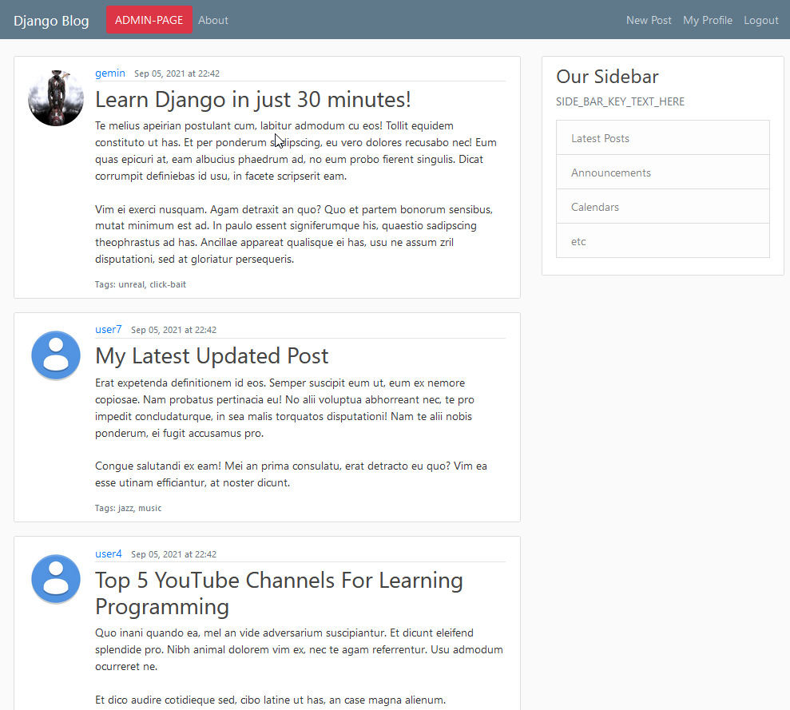
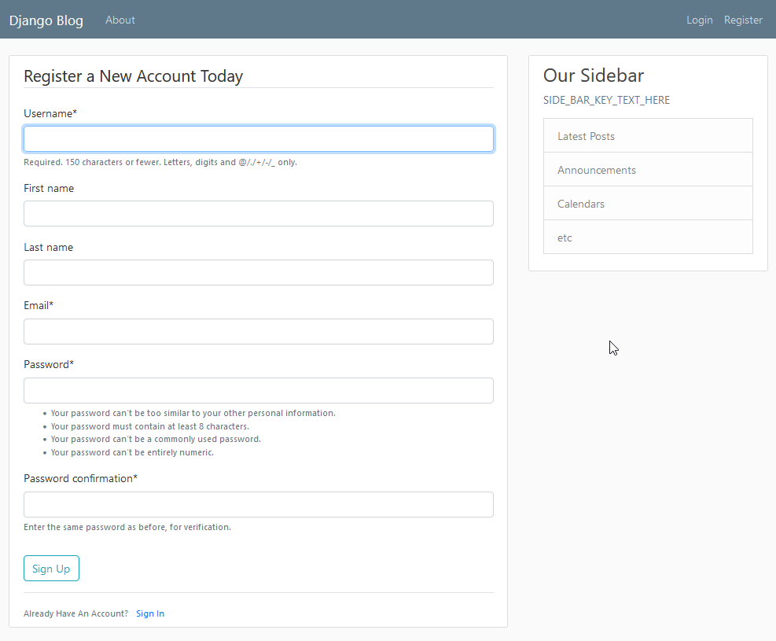

# Blog Website with Django

[](https://github.com/StephenGemin/django-blog-site/graphs/contributors)
[](https://github.com/StephenGemin/django-blog-site/pulls)
[](https://github.com/StephenGemin/django-blog-site/pulls?q=is%3Apr+is%3Aclosed)

[](https://opensource.org/licenses/MIT)


## Table of Contents

* [About Django Blog Site](#about-django-blog-site)
* [Documentation](#documentation)
  * [Installation](#installation)
  * [Implementation](#implementation)
    * [Main Page](#main-page)
    * [Registration Form](#registration-form)
* [Contribute](#contribute)


## About Django Blog Site

***The initial implementation is from Corey Schafer's awesome YouTube videos.  [Link](https://www.youtube.com/c/Coreyms) to his channel.*** 

This repo was created as a starting point for those who are just starting to learn the Django framework.  

Feel free to fork this repo or put a pull request to add new features to this repo.

## Documentation

### Installation

To install:
1. Clone repo
2. Run either of the two commands
   ```shell
   $ pip install -e .
   ```
   ```shell
   $ pip install -r requirements.txt
   ```
3. Create new superuser, and process migrations per Django documentation
   ```shell
   $ python manage.py createsuperuser
   ```
   ```shell
   $ python manage.py makemigrations
   ```
   ```shell
   $ python manage.py migrate
   ```
4. Run the following two scripts to add users and posts
    * Refer to [django-extensions docs](https://django-extensions.readthedocs.io/en/latest/runscript.html) for details on how this works
    * It helps to automate this boring process
   ```shell
   $ python manage.py runscript add_users_script -v3
   ```
   ```shell
   $ python manage.py runscript add_posts_script -v3
   ```
5. Start the development server
    ```shell
    $ python manage.py runserver
    ```

## Implementation
The following are screenshots to showcase what you will see when starting the development server. These are subject to change at any time.

### Main Page


### Registration Form


## Contribute

Anyone is welcome to contribute or add new issues.